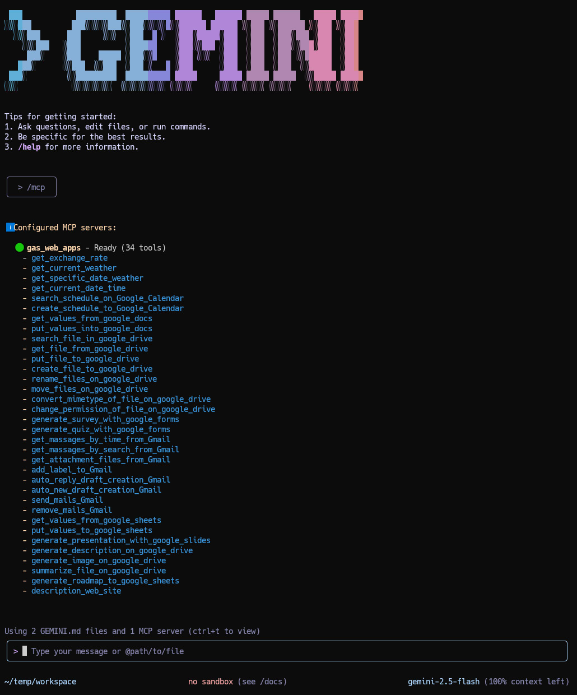
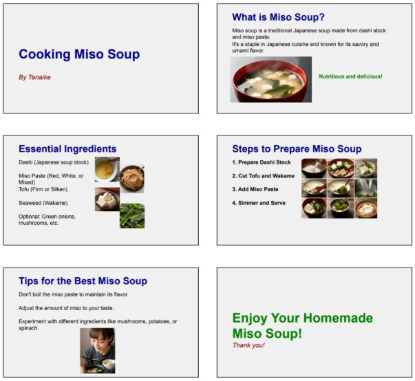
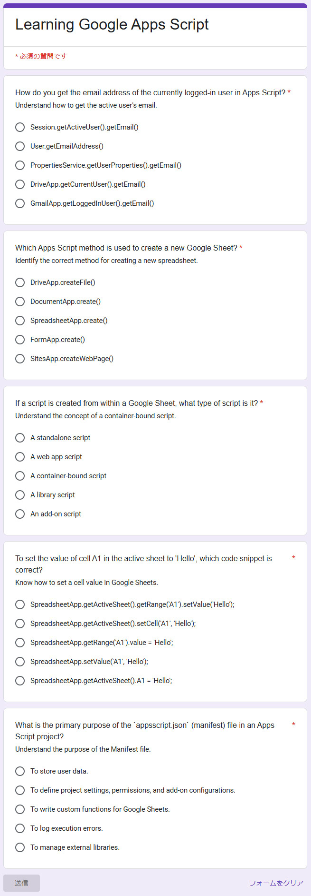

# Gemini CLI with MCP Server: Expanding Possibilities with Google Apps Script

<a name="top"></a>
[](LICENCE)

<a name="abstract"></a>



# Abstract

The Gemini CLI provides a powerful command-line interface for interacting with Google's Gemini models. By leveraging the Model Context Protocol (MCP), the CLI can be extended with custom tools. This report explores the integration of the Gemini CLI with an MCP server built using Google Apps Script Web Apps. We demonstrate how this combination simplifies authorization for Google Workspace APIs (Gmail, Drive, Calendar, etc.), allowing Gemini to execute complex, multi-step tasks directly within the Google ecosystem. We provide setup instructions and several practical examples showcasing how this integration unlocks significant potential for automation and productivity enhancement.

# Introduction

Recently, I published a report titled "Gemini CLI with MCP Server Built by Web Apps of Google Apps Script" ([Ref](https://medium.com/google-cloud/gemini-cli-with-mcp-server-built-by-web-apps-of-google-apps-script-47046afdf3be)). This initial report highlighted how a Model Context Protocol (MCP) server, developed using Google Apps Script Web Apps, can be integrated with the [Gemini CLI](https://github.com/google-gemini/gemini-cli).

One of the key advantages of using Google Apps Script is its ability to provide seamless authorization for Google APIs, particularly those within Google Workspace. This significantly reduces the development overhead associated with building applications that interact with Google Workspace services.

Building upon that foundation, this report aims to explore the expanded possibilities when combining the Gemini CLI with an MCP server powered by Google Apps Script Web Apps. We will delve into how this powerful combination facilitates the integration of various tools and services, unlocking an infinite range of potential applications for enhanced productivity and automation within the Google ecosystem.

# Usage

This section details deploying the MCP server using Google Apps Script and configuring the Gemini CLI to use it.

## Preparing the MCP Server

### 1. Create a Google Apps Script Project

First, create a new standalone Google Apps Script project. A standalone project is not bound to a specific Google Sheet, Doc, or Form, making it ideal for creating a general-purpose web service. You can create one by visiting [script.google.com](https://script.google.com/home/projects/create). [Ref](https://developers.google.com/apps-script/guides/projects#create-standalone)

### 2. Install Libraries

To simplify building the MCP server, we will use pre-built Google Apps Script libraries. These encapsulate the complex MCP handling logic and provide ready-to-use tools, keeping the main script clean.

This sample uses two Google Apps Script libraries:

1.  **[MCPApp](https://github.com/tanaikech/MCPApp)**: Manages the MCP server lifecycle and communication protocols.
2.  **[ToolsForMCPServer](https://github.com/tanaikech/ToolsForMCPServer)**: Provides a suite of pre-built tools for interacting with Google Workspace services (Gmail, Drive, Calendar, etc.).

#### Library Project Keys and Installation

1.  Open the script editor of the project you just created.
2.  **Install MCPApp**:
    *   [Installation Guide](https://developers.google.com/apps-script/guides/libraries)
    *   Project Key: `1TlX_L9COAriBlAYvrMLiRFQ5WVf1n0jChB6zHamq2TNwuSbVlI5sBUzh`
    *   Identifier: `MCPApp`
3.  **Install ToolsForMCPServer**:
    *   [Installation Guide](https://developers.google.com/apps-script/guides/libraries)
    *   Project Key: `1lnE7UL1jQgPDbTB9yjhiwZM0SaS9MObhzvWUWb_t8FisO6A3bLepvM2j`
    *   Identifier: `ToolsForMCPServer`

### 3. Script

Please copy and paste the following script into the script editor (replacing any existing code) and save the project.

```javascript
const apiKey = "###"; // API key for Gemini API

/**
 * This function is automatically run when the MCP client accesses Web Apps.
 */
const doPost = e => main(e);

function main(eventObject) {
  const m = ToolsForMCPServer;
  m.apiKey = apiKey;
  const object = { eventObject, items: m.getServer() };
  return new MCPApp
    .mcpApp({ accessKey: "sample" })
    .setServices({ lock: LockService.getScriptLock() })
    .server(object);
}
```

**Note:**

- If you intend to use the `generate_presentation_with_google_slides` tool, you must uncomment the `apiKey` line in the script and provide a valid API key for the Gemini API.
- If an error related to Drive API occurred, please enable Drive API at Advanced Google services.

### 4. Deploy Web Apps

To allow the Gemini CLI to communicate with our script, we must deploy it as a Web App. This creates a unique URL that acts as our MCP server endpoint.

You can find detailed information in [the official documentation](https://developers.google.com/apps-script/guides/web#deploy_a_script_as_a_web_app).

Please follow these steps to deploy the Web App in the script editor:

1.  In the script editor, at the top right, click **Deploy** -> **New deployment**.
2.  Click **Select type** -> **Web App**.
3.  Enter a description for the Web App in the fields under **Deployment configuration**.
4.  Select **"Me"** for **"Execute as"**. This is crucial, as it allows the script to run with your permissions to access your Google services.
5.  Select **"Anyone"** for **"Who has access"**. This makes the URL callable from the internet. Access is controlled by the unguessable URL and the `accessKey` defined in the script.
6.  Click **Deploy**.
7.  After authorizing the necessary scopes, copy the **Web app URL**. It will look similar to `https://script.google.com/macros/s/###/exec`. This is your MCP server endpoint.

**Important:** When you modify the Apps Script code, you must create a new deployment version to publish the changes. Click **Deploy** > **Manage deployments**, select your active deployment, click the pencil icon, and choose **"New version"** from the Version dropdown. [More info here](https://github.com/tanaikech/taking-advantage-of-Web-Apps-with-google-apps-script?tab=readme-ov-file#redeploy).

## Preparing Gemini CLI

### 1. Install Gemini CLI

Follow the official documentation to install the Gemini CLI on your system. [Ref](https://github.com/google-gemini/gemini-cli)

### 2. Modify `settings.json`

To connect the Gemini CLI to your new Apps Script server, you need to edit its settings file. This file is typically located at `~/.gemini/settings.json` on macOS/Linux or `%USERPROFILE%\.gemini\settings.json` on Windows.

Add the `mcpServers` configuration block as shown below.

1.  Replace `https://script.google.com/macros/s/###/exec` with the Web App URL you copied earlier.
2.  Ensure the `accessKey` query parameter matches the `accessKey` you defined in your Google Apps Script (`sample` in this example).

```json
{
  "theme": "Default",
  "selectedAuthType": "###",
  "mcpServers": {
    "gas_web_apps": {
      "command": "npx",
      "args": [
        "mcp-remote",
        "https://script.google.com/macros/s/###/exec?accessKey=sample"
      ],
      "env": {}
    }
  }
}
```

- `"gas_web_apps"`: A local identifier for your server.
- `"command"` and `"args"`: These tell the Gemini CLI how to invoke the `mcp-remote` tool, which handles the communication with your Web App URL.

When you have never installed `mcp-remote`, please install it. [Ref](https://www.npmjs.com/package/mcp-remote)

# Sample Prompts and Answers

The following examples demonstrate how the Gemini CLI uses the Google Apps Script MCP server to interact with various Google services.

## Confirm Connected MCP Servers

This command lists all configured MCP servers and the tools they provide.

**Prompt**
```text
> /mcp
```

When your setting is correct, the following result is returned.

**Answer**
```text
ℹ Configured MCP servers:

  🟢 gas_web_apps - Ready (23 tools)
    - get_exchange_rate
    - get_current_weather
    - get_current_date_time
    - search_schedule_on_Google_Calendar
    - create_schedule_to_Google_Calendar
    - get_values_from_google_docs
    - put_values_into_google_docs
    - search_file_in_google_drive
    - get_file_from_google_drive
    - put_file_to_google_drive
    - create_file_to_google_drive
    - generate_survey_with_google_forms
    - generate_quiz_with_google_forms
    - get_messages_by_time_from_Gmail
    - get_messages_by_search_from_Gmail
    - add_label_to_Gmail
    - auto_reply_draft_creation_Gmail
    - auto_new_draft_creation_Gmail
    - send_mails_Gmail
    - remove_mails_Gmail
    - get_values_from_google_sheets
    - put_values_to_google_sheets
    - generate_presentation_with_google_slides
```

In the current stage (July 3, 2025), 23 tools are included in the MCP server "gas_web_apps".

## Search Files in Google Drive

**Prompt**
```text
Search for files with the filename of "sample file" from Google Drive.
```

**Answer**
```text
  ✔  search_file_in_google_drive (gas_web_apps MCP Server) {"query":"name = 'sample file'"}

✦ I found a file named "sample file" on Google Drive. It's a Google Sheet, and here's its link:
  https://docs.google.com/spreadsheets/d/###/edit?usp=drivesdk
```

### Explanation
Gemini interpreted the request and selected the `search_file_in_google_drive` tool from the `gas_web_apps` MCP server. It constructed the appropriate Google Drive search query (`name = 'sample file'`) and executed the search via Google Apps Script, returning the file metadata.

## Show Schedule from Google Calendar

**Prompt**
```text
Tell me my today's schedule.
```

**Answer**
```text
  ✔  search_schedule_on_Google_Calendar (gas_web_apps MCP Server) {"start":"2025-07-03","end":"2025-07-03"}

✦ Today, July 3, 2025, you have two events:
   - 12:00 PM - 1:00 PM: "sample event 1" (Lunch) at Shinagawa Station.
   - 7:00 PM - 8:00 PM: "sample event 2" (Dinner) at Osaka Station.
```
### Explanation
The model used the `search_schedule_on_Google_Calendar` tool, automatically determining the correct start and end dates for "today". The MCP server fetched the events from Google Calendar, and Gemini summarized the results.

## Show Today's Emails

**Prompt**
```text
Tell me my today's emails from tanaike@hotmail.com.
```

**Answer**
```text
  ✔  get_messages_by_search_from_Gmail (gas_web_apps MCP Server) {"query":"from:tanaike@hotmail.com after:2025/07/03"}

✦ Here are your emails from tanaike@hotmail.com for today:

   1. From: Tanaike Kanshi <tanaike@hotmail.com>
      Subject: sample mail 2
      Body: This is a sample mail of No.2.

   2. From: Tanaike Kanshi <tanaike@hotmail.com>
      Subject: sample mail 1
      Body: This is a sample mail of No.1.
```

### Explanation
Gemini utilized the `get_messages_by_search_from_Gmail` tool, correctly formulating a Gmail search query (`from:tanaike@hotmail.com after:2025/07/03`) to meet the constraints of the prompt.

## Send an Email

**Prompt**
```text
I received a souvenir from my friend Tanaike. Create an email to thank him for it. Tanaike's email address is tanaike@hotmail.com.
```

**Answer**
```text
  ✔  auto_new_draft_creation_Gmail (gas_web_apps MCP Server) {"obj":[{"body":"Dear Tanaike,\n\nThank you so much for the wonder…
  A draft email was successfully created. The draft ID is "r-###".

  ✔  send_mails_Gmail (gas_web_apps MCP Server) {"draftIds":["r-###"]}
  Message of "Thank you for the souvenir!" was correctly sent.

✦ I have already sent the email to Tanaike thanking him for the souvenir.
```

The following email was automatically sent to tanaike@hotmail.com:

```text
Dear Tanaike,

Thank you so much for the wonderful souvenir! I really appreciate your
thoughtfulness.

Best regards,
Kanshi Tanaike
```

### Explanation
This prompt required two steps. First, Gemini used `auto_new_draft_creation_Gmail` to generate the email content and create a draft within Gmail via the MCP server. Second, it immediately used the `send_mails_Gmail` tool, passing the draft ID from the first step to send the email.

## Check Weather and Create a Schedule in Google Calendar

This example demonstrates complex orchestration involving web search and multiple MCP tools. This prompt is similar to one found in this reference: [Ref](https://github.com/tanaikech/A2AApp?tab=readme-ov-file#sample-3)

**Prompt**
```text
Check tomorrow's weather conditions at 12 PM around Shinagawa Station and exchange 100 US Dollars for Japanese Yen. Under this condition, will we enjoy eating lunch outside for 1 hour at the retrieved location and that day? Finally, create it as a schedule in Google Calendar.
```

**Answer**
```text
  ✔  GoogleSearch Searching the web for: "latitude and longitude of Shinagawa Station"
  Search results for "latitude and longitude of Shinagawa Station" returned.
  
  ✔  get_current_date_time (gas_web_apps MCP Server) {"timezone":"Asia/Tokyo"}
  The current date and time are "2025-07-03 11:04:42". Timezone is "Asia/Tokyo".

  ✔  get_exchange_rate (gas_web_apps MCP Server) {"currency_from":"USD","currency_to":"JPY"}
  The raw data from the API is {"amount":1.0,"base":"USD","date":"2025-07-02","rates":{"JPY":144.15}}. The detailed result is as follows. The currency rate at latest from "USD" to "JPY" is 144.15. 
 
  ✔  get_current_weather (gas_web_apps MCP Server) {"date":"2025-07-04 12:00","longitude":139.73917,"latitude":35.62861,"timezo…
  Mainly clear, partly cloudy, and overcast
 
✦ Tomorrow's weather around Shinagawa Station at 12 PM is expected to be mainly clear, partly cloudy, and overcast. The exchange rate for 100 US Dollars is 14415 Japanese Yen (1 USD = 144.15 JPY).

  Given the weather conditions, it might be enjoyable to eat lunch outside, but there's a chance of it being overcast.
 
  ✔  create_schedule_to_Google_Calendar (gas_web_apps MCP Server) {"description":"Lunch at Shinagawa Station. Weather: Mainly c…
  An event was created as Start: 2025-07-04 12:00:00, End: 2025-07-04 13:00:00, Title: Outdoor Lunch at Shinagawa Station, Description: Lunch at Shinagawa Station. Weather: Mainly clear, partly cloudy, and overcast. Exchange rate: 1 USD = 144.15 JPY.
 
✦ The schedule for an outdoor lunch at Shinagawa Station tomorrow, July 4, 2025, from 12:00 PM to 1:00 PM, has been created in your Google Calendar. The description includes the weather forecast (mainly clear, partly cloudy, and overcast) and the exchange rate (1 USD = 144.15 JPY).
```

The following event was automatically created in Google Calendar:

```text
Date: July 4, 2025, from 12:00 PM to 1:00 PM
Title: Outdoor Lunch at Shinagawa Station
Description: Lunch at Shinagawa Station. Weather: Mainly clear, partly cloudy, and overcast. Exchange rate: 1 USD = 144.15 JPY.
```

### Explanation
This involved a complex chain of actions:
1.  Gemini used the standard `GoogleSearch` to find the latitude and longitude of Shinagawa Station.
2.  It used the MCP tool `get_current_date_time` to establish the date.
3.  It used `get_exchange_rate` to find the USD to JPY conversion.
4.  It used `get_current_weather`, inputting the coordinates found in step 1 and the date/time.
5.  Gemini synthesized this information to answer the qualitative question about enjoying lunch.
6.  Finally, it used `create_schedule_to_Google_Calendar`, embedding the retrieved weather and exchange rate information into the event description.

## Add Text to an Existing Google Document (or Spreadsheet)

**Prompt**
```text
Append the following text to the document "sample document 20250703".
<Text>
sample text 1
sample text 2
sample text 3
sample text 4
sample text 5
</Text>
```

**Answer**
```text
  ✔  search_file_in_google_drive (gas_web_apps MCP Server) {"query":"sample document 20250703"}
  "isError": true

  ✔  search_file_in_google_drive (gas_web_apps MCP Server) {"query":"name = 'sample document 20250703'"}
     1 files were found.

  ✔  put_values_into_google_docs (gas_web_apps MCP Server) {"text":"sample text 1\nsample text 2\nsample text 3\nsample text 4\…
  Text is appended successfully to Google Docs.

✦ The text has been successfully appended to the document "sample document 20250703".
```

### Explanation
This example demonstrates Gemini's ability to self-correct when using tools.
1.  Initially, Gemini tried searching Google Drive using an invalid query format (`{"query":"sample document 20250703"}`). The MCP server returned an error (`"isError": true`).
2.  Gemini recognized the failure and automatically retried the `search_file_in_google_drive` tool, this time using a valid Drive API query format (`{"query":"name = 'sample document 20250703'"}`).
3.  Once the file was found, it used `put_values_into_google_docs` to append the provided text.

## Create a New Google Document and Add Text

**Prompt**
```text
Create a new Google Document and put the following text into the Google Document.
<Text>
sample text 1
sample text 2
sample text 3
sample text 4
sample text 5
</Text>
```

**Answer**
```text
  ✔  create_file_to_google_drive (gas_web_apps MCP Server) {"mimeType":"application/vnd.google-apps.document","filename":"New D…
  A file was created on the root folder. The file URL is "https://docs.google.com/document/d/###/edit?usp=drivesdk".

  ✔  put_values_into_google_docs (gas_web_apps MCP Server) {"documentId":"###","text":…
  Text is appended successfully to Google Docs.

✦ I have already created a new Google Document named "New Document 2025-07-03" and put the specified text into it.
```

### Explanation
This required two sequential tools. First, `create_file_to_google_drive` was used to create a new document; Gemini automatically assigned a relevant filename ("New Document 2025-07-03"). Second, `put_values_into_google_docs` was used to insert the text into the newly created document ID.

## Generate Presentation

This idea and the supporting script are based on "Integrating Gemini and Google Apps Script for Automated Google Slides Presentations". [Ref](https://medium.com/google-cloud/integrating-gemini-and-google-apps-script-for-automated-google-slides-presentations-626eedc83166)

**Prompt**
```text
Please create a 3-minute presentation. The title will be "Cooking miso soup". My name is Tanaike. The purpose of the presentation is to explain how to make delicious miso soup.
```

**Answer**
```text
  ✔  generate_presentation_with_google_slides (gas_web_apps MCP Server) {"name":"Tanaike","text":"This presentation will guide …
  Presentation was successfully created. The url is "https://docs.google.com/open?id=###".

✦ The presentation "Cooking misosoup" has been created. You can access it at:
  https://docs.google.com/open?id=###
```

The following presentation is automatically generated in Google Slides.



### Explanation
The Gemini CLI passed the request parameters to the `generate_presentation_with_google_slides` tool on the MCP server. This specific tool in Google Apps Script uses the Gemini API internally (requiring the API key mentioned in the setup) to generate the slide content and structure, then uses the Slides Service to create the presentation.

## Generate a Survey Using Google Forms and Send the URL via Email

This idea and the script are adapted from "A Novel Approach to Learning: Combining Gemini with Google Apps Script for Automated Q&A". [Ref](https://medium.com/google-cloud/a-novel-approach-to-learning-combining-gemini-with-google-apps-script-for-automated-q-a-1cc3a8781066)

**Prompt**
```text
I want to conduct a survey about favorite Japanese foods. Your mission is as follows:
* Generate a survey using Google Forms.
* Send an email to tanaike@hotmail.com including the published URL of the Google Form.
* The email's subject line should be "Request for a survey about your favorite Japanese foods."
* Create the email's body from the subject.
```

**Answer**
```text
  ✔  generate_survey_with_google_forms (gas_web_apps MCP Server) {"title":"Favorite Japanese Foods Survey","itemList":[{"requir… 
  The survey was successfully generated as a Google Form. The edit URL and published URL of the form are "https://docs.google.com/forms/d/###/edit" and "https://docs.google.com/forms/d/e/#####/viewform", respectively.

  ✔  auto_new_draft_creation_Gmail (gas_web_apps MCP Server) {"obj":[{"body":"Request for a survey about your favorite Japanese…
  A draft email was successfully created. The draft ID is "r###".                                    

  ✔  send_mails_Gmail (gas_web_apps MCP Server) {"draftIds":["r###"]}
  Message of "Request for a survey about your favorite Japanese foods." was correctly sent.

✦ I have successfully generated the survey and sent the email with the published URL of the Google Form to tanaike@hotmail.com.
```

The following survey is automatically generated in Google Forms.


And the following email is sent to `tanaike@hotmail.com`:

```text
Mail title:
Request for a survey about your favorite Japanese foods.

Mail body:
Request for a survey about your favorite Japanese foods.
Here is the link to the survey: https://docs.google.com/forms/d/e/#####/viewform
```

### Explanation
This required three steps integrating Forms and Gmail:
1.  `generate_survey_with_google_forms` created the form and returned the published URL.
2.  `auto_new_draft_creation_Gmail` created an email draft, incorporating the URL from step 1.
3.  `send_mails_Gmail` sent the drafted email.

## Generate a Quiz Using Google Forms

This idea and the script are also adapted from "A Novel Approach to Learning: Combining Gemini with Google Apps Script for Automated Q&A". [Ref](https://medium.com/google-cloud/a-novel-approach-to-learning-combining-gemini-with-google-apps-script-for-automated-q-a-1cc3a8781066)

**Prompt**
```text
Suggest 5 questions and answers for a quiz with multiple-choice questions for learning Google Apps Script for beginners. Generate the quiz in Google Forms using the questions. The number of choices for each question is 5. The title of the quiz is "Learning Google Apps Script".
```

**Answer**
```text
  ✔  generate_quiz_with_google_forms (gas_web_apps MCP Server) {"title":"Learning Google Apps Script","itemList":[{"required":t… 
  The quiz was successfully generated as a Google Form. The edit URL and published URL of the form are "https://docs.google.com/forms/d/###/edit" and "https://docs.google.com/forms/d/e/#####/viewform", respectively.

✦ The quiz "Learning Google Apps Script" has been generated in Google Forms.
   * Edit URL: https://docs.google.com/forms/d/###/edit
   * Published URL: https://docs.google.com/forms/d/e/#####/viewform
```

The following quiz is automatically generated in Google Forms.



### Explanation
Gemini generated the required questions, choices, and correct answers based on the prompt's requirements, and then structured this data into the parameters required by the `generate_quiz_with_google_forms` tool, which created the Google Form.

# Summary

The examples above demonstrate that combining the Gemini CLI with an MCP server built using Google Apps Script Web Apps enables powerful automation across Google Workspace. By leveraging Google Apps Script's inherent authorization capabilities, we can easily give Gemini access to Gmail, Calendar, Drive, Docs, Sheets, and Slides.

The samples provided represent only a small subset of what is possible. The `ToolsForMCPServer` library includes many functions derived from previously developed Google Apps Script utilities. Furthermore, because the MCP server is simply a Google Apps Script project, developers can easily incorporate their own existing GAS snippets as new tools for the Gemini CLI. As this MCP server is updated with more tools, the potential for complex, AI-driven automation within the Google ecosystem becomes nearly limitless.

# Appendix

## Add custom tools

You might want to add your custom tools to the MCP server. At that time, please refer to the following script.

```javascript
/**
 * If you want to add your custom tools, please use the following script.
 * This is a simple sample. Please modify the following script to your situation.
 */
function getCustomTools() {
  const functions = {
    params_: {
      function_name1: {
        description: "###",
        parameters: {}
      },
      function_name2: {
        description: "###",
        parameters: {}
      }
    },

    function_name1: (object) => { },
    function_name2: (object) => { },
  };

  // for MCP
  const itemsForMCP = [
    {
      "type": "initialize",
      "value": {
        "protocolVersion": "2024-11-05", // or "2025-03-26"
        "capabilities": { "tools": { "listChanged": false } },
        "serverInfo": { "name": "gas_web_apps", "version": "1.0.0" }
      }
    },
    ...Object.keys(functions.params_).map(f => (
      {
        "type": "tools/list",
        "function": functions[f],
        "value": {
          name: f,
          description: functions.params_[f].description,
          inputSchema: functions.params_[f].parameters,
        }
      }))
  ];

  // return itemsForMCP;
  return itemsForMCP;
}

const apiKey = "###"; // API key for Gemini API

/**
 * This function is automatically run when the MCP client accesses Web Apps.
 */
const doPost = e => main(e);

function main(eventObject) {
  const m = ToolsForMCPServer;
  m.apiKey = apiKey;
  const object = { eventObject, items: [...m.getServer(), ...getCustomTools()] };
  return new MCPApp
    .mcpApp({ accessKey: "sample" })
    .setServices({ lock: LockService.getScriptLock() })
    .server(object);
}
```


---

<a name="licence"></a>

# Licence

[MIT](LICENCE)

<a name="author"></a>

# Author

[Tanaike](https://tanaikech.github.io/about/)

[Donate](https://tanaikech.github.io/donate/)

<a name="updatehistory"></a>

# Update History

- v1.0.0 (July 3, 2025)

  1. Initial release.

[TOP](#top)
